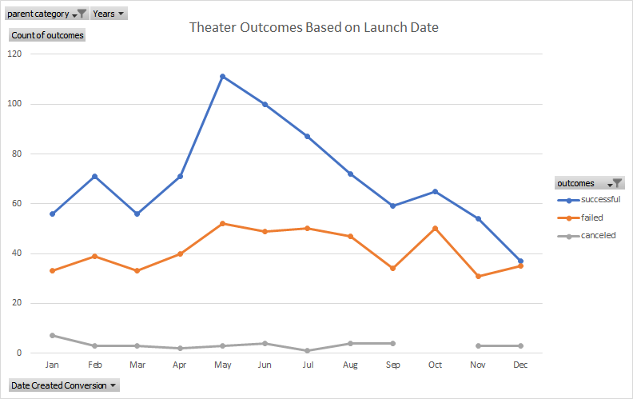
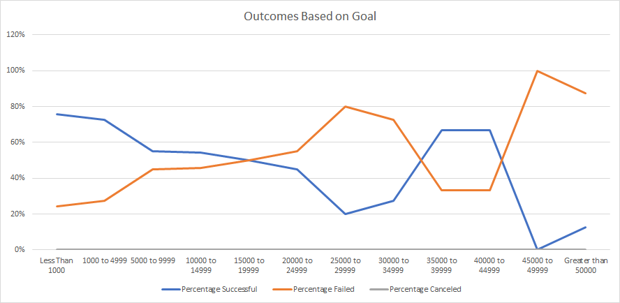

# Kickstarting with Excel

## Overview of Project

To perform an analysis on Kickstarter data to uncover how theater campaigns fare in relation to their launch dates and their funding goals.

## Analysis and Challenges

### Analysis of Outcomes Based on Launch Date

In order to see how outcomes are affected by launch date, we first had to create a pivot table. By filtering the table by "Parent Category" and "Years", we can filter the data to only show "theater" and to group by month. We want the rows to show the launch month, the columns to be the types of outcomes, and each value to be the total number of each outcome. Lastly, we visualize this table using a line graph, thus easily recognizing which months are best and worst.

### Analysis of Outcomes Based on Goals

To find out how outcomes change based on funding goals, we need to find out the total number of successes, failures, and cancellations for each funding goal. We created ranges for us to easily group the campaigns based on their goal amount. Next, we find the percentages of successful campaigns by dividing the number of successful campigns by the total amount of campaigns. We do this for each goal amount group and for the failed and canceled campaigns. Graphing these percentages, we can see that successful outcomes and inversely related to failed outcomes, with no campaigns being canceled.

### Challenges and Difficulties Encountered

A challenge I faced when finding the total number of success, failures, and cancellations was that I had to make sure I included all the necessary criteria in the COUNTIFS function. Incorrectly doing so gave me a different count of each type of outcome. The criteria needed to retrieve the correct count are the goal amount range, the type of outcome, and the category "plays".

`=COUNTIFS(Kickstarter!$H:$H,"successful",Kickstarter!$D:$D,"<1000",Kickstarter!$U:$U,"plays")`

## Results

- We can conclude that the most successful theater campaigns had a launch date of May. Contrarily, we can see that December is the lease successful time to launch.

- Campaigns with a funding goal of less than 20,000 all had a 50% chance or higher success rate. Inversely, we can see that campaigns with a funding goal greater than 20,000 had a higher failure rate.

- A limitation of this dataset might be that it does not show us a specific area or city within a country. The campaign might have only been successful in an urban city compared to the suburbs. We do not know where in the country the campaign was successful.

- A possible table we could create would be Launch Date vs Funding Goal. It could show us if more or less funding is required during a specific time or season of the year.
